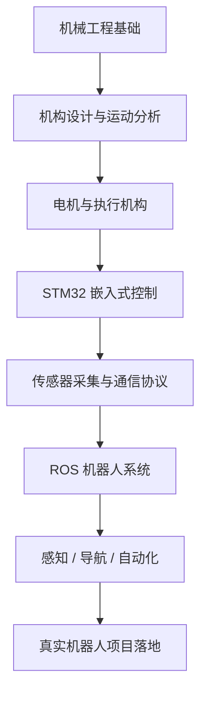

<div align="center">


<br/>


<br/>


</div>

---

## 👋 关于我

你好，我是 **LiuEggy**。

我是一名机械工程专业本科生，目前主要学习和实践：

- **嵌入式开发**：STM32、HAL、FreeRTOS、UART、I2C、SPI、PWM、DMA
- **机器人系统**：ROS、小车底盘、传感器融合、串口通信、导航与控制
- **嵌入式 Linux**：RK3568、Linux 设备管理、摄像头、雷达、串口设备
- **机械设计**：SolidWorks、CAD、机构设计、运动结构分析
- **AI 工具链**：AI Agent、自动化工作流、开发效率工具

我喜欢做能真正落地的项目：  
从机械结构，到电机驱动，到传感器采集，再到上层 ROS 控制，把系统完整跑起来。

---

## 🧭 当前方向

```txt
机械结构设计
    ↓
电机 / 舵机 / 传感器
    ↓
STM32 嵌入式控制
    ↓
ROS 通信与机器人控制
    ↓
感知、导航、自动化系统
```

---

## 🛠 技术栈

### 编程语言

<p>
  
</p>

### 嵌入式与机器人

<p>
  
</p>

### 开发工具

<p>
  
</p>

---

## 🤖 我正在学习 / 构建

<table>
  <tr>
    <td width="50%" valign="top">

### 🔌 STM32 嵌入式

- GPIO / EXTI 外部中断
- TIM 定时器 / PWM 输出
- UART / DMA / 空闲中断
- I2C / SPI / OLED 显示
- ADC / 编码器 / 电机驱动
- FreeRTOS 任务调度

</td>
<td width="50%" valign="top">

### 🚗 ROS 机器人

- 小车底盘控制
- 串口协议设计
- 传感器数据发布
- 摄像头与雷达接入
- ROS Topic / Launch 调试
- 导航与建图方向探索

</td>
  </tr>
</table>

---

## 📌 项目展示

| 项目 | 简介 | 方向 |
|---|---|---|
| [Embed_book](https://github.com/liueggy/Embed_book) | 嵌入式学习笔记与资料整理 | Embedded |
| [STM32_code](https://github.com/liueggy/STM32_code) | STM32 外设实验与工程代码 | STM32 |
| [rk3568-notes](https://github.com/liueggy/rk3568-notes) | RK3568 与嵌入式 Linux 学习记录 | Linux |
| [Ros_car_app](https://github.com/liueggy/Ros_car_app) | ROS 小车相关应用与控制探索 | Robotics |
| [personal_website](https://github.com/liueggy/personal_website) | 个人网站项目 | Website |

---

## 📊 近期活动与数据

<div align="center">


<br/><br/>


<br/><br/>


</div>

---

## 🏆 GitHub 成就

<div align="center">


</div>

---

## 🧩 我的学习路线



---

## 🧠 最近关注的关键词

```txt
STM32 HAL
FreeRTOS
UART DMA
PWM Motor Control
Encoder Feedback
ROS Noetic
Robot Navigation
RK3568
Embedded Linux
AI Agent
```

---

## 🧪 工程理念

> 不只是让代码能跑，而是让系统稳定、可调、可维护。  
> 不只是画出机械结构，而是让它和控制系统真正配合起来。

---

## 🌐 联系我

- GitHub: [@liueggy](https://github.com/liueggy)
- Website: [liueggy.live](https://liueggy.live)

---

<div align="center">


</div>
